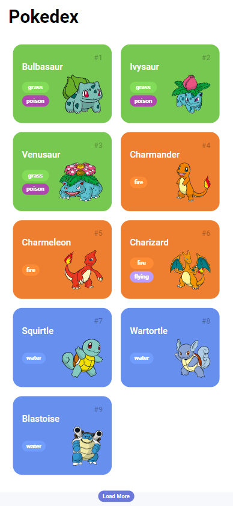
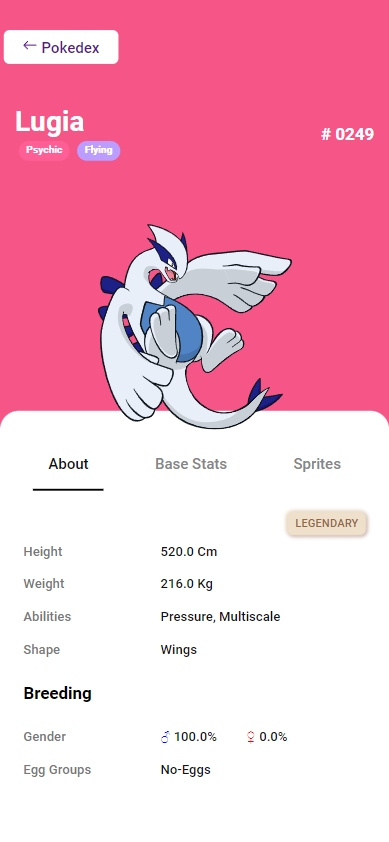
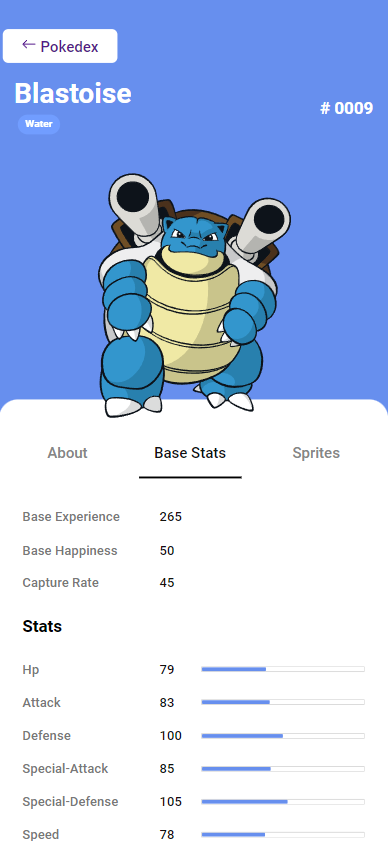

# Trilha JS Developer - Pokedex

## Run the project locally

make sure you have NodeJS installed

open the terminal inside your projects folder

run the following commands:

```
git clone https://github.com/PregoBS/js-developer-pokedex
cd js-developer-pokedex
npx http-server .\
```

## Screenshots

### Home Page



### About Page



### Base Stats Page



### Sprites Page

