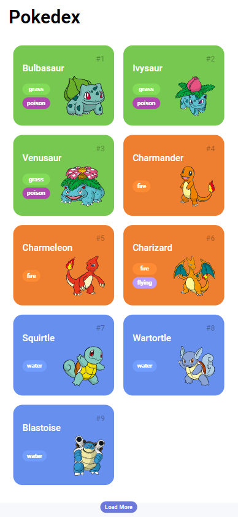
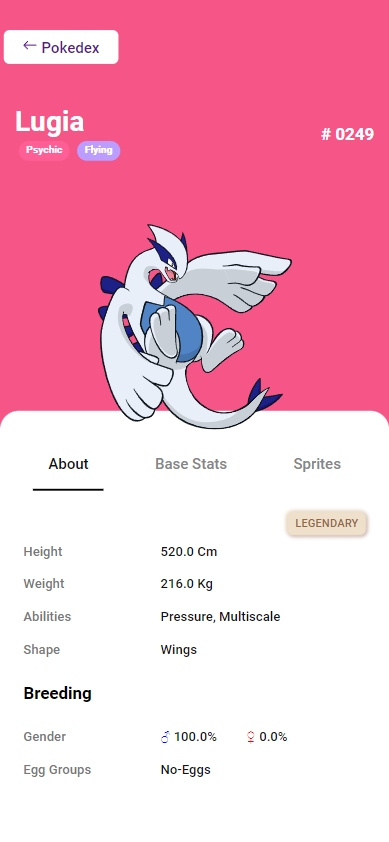
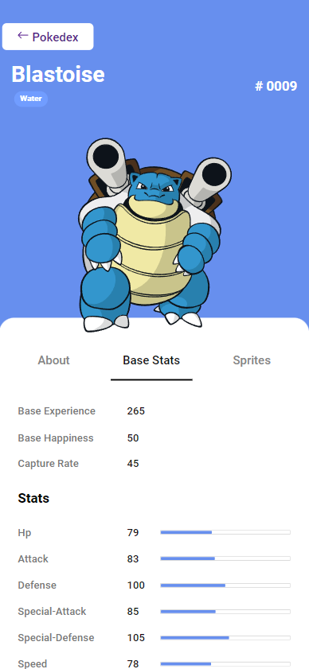
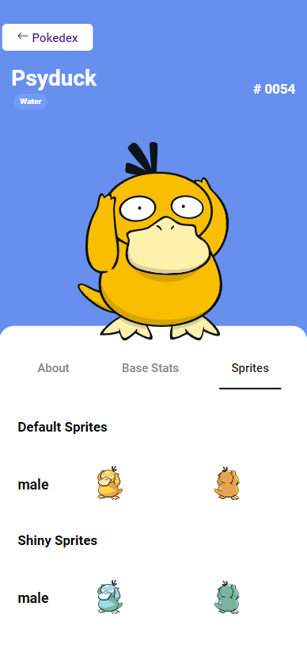

# Trilha JS Developer - Pokedex

see [Pokédex](https://pokedex.pregobs.xyz) in production

## Run the project locally

make sure you have NodeJS installed

open the terminal inside your projects folder

run the following commands:

```
git clone https://github.com/PregoBS/js-developer-pokedex
cd js-developer-pokedex
npx http-server .\
```
---
Projeto desenvolvido como solução ao [Desafio de Projeto](https://web.dio.me/lab/construindo-uma-pokedex-com-javascript/learning/a6cccca3-fffe-486d-a5f9-8472484dd3e4) da [DIO](https://dio.me)

- Adicionei novas telas
- Layout responsivo
- Cache das requisições

## Screenshots

### Home Page



### About Page



### Base Stats Page



### Sprites Page


